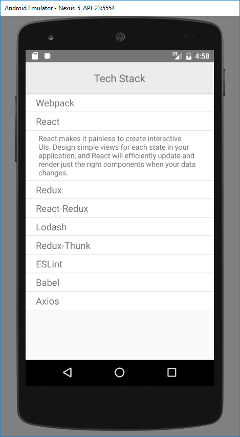

# Tech Stack App

This project is a simple phone app that I made to enhance my understand of React Native for phone apps.

It features an interactive list of technologies in the development stack, that displays a short summary when tapped on.



###Usage###

Requirements:

1. Node.js
2. React Native
3. Android Studio with an Android Virtual Device emulator

Steps:

1. Clone this project and extract it on your computer
2. Open Android Studio and run an Android Virtual Device
3. Open a terminal and change to the project directory
4. Enter the following commands:

	```
		> npm install
		> react-native run-android
	```
